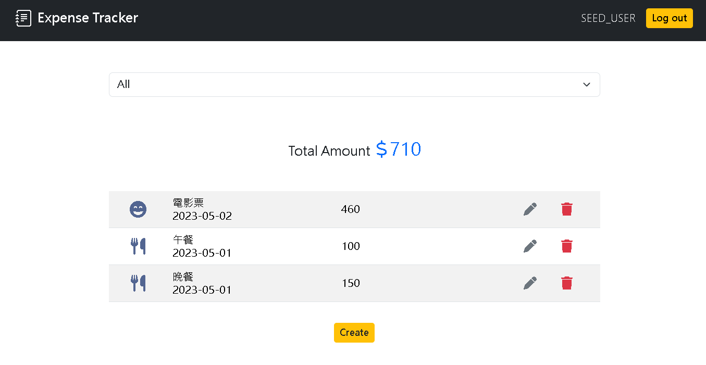
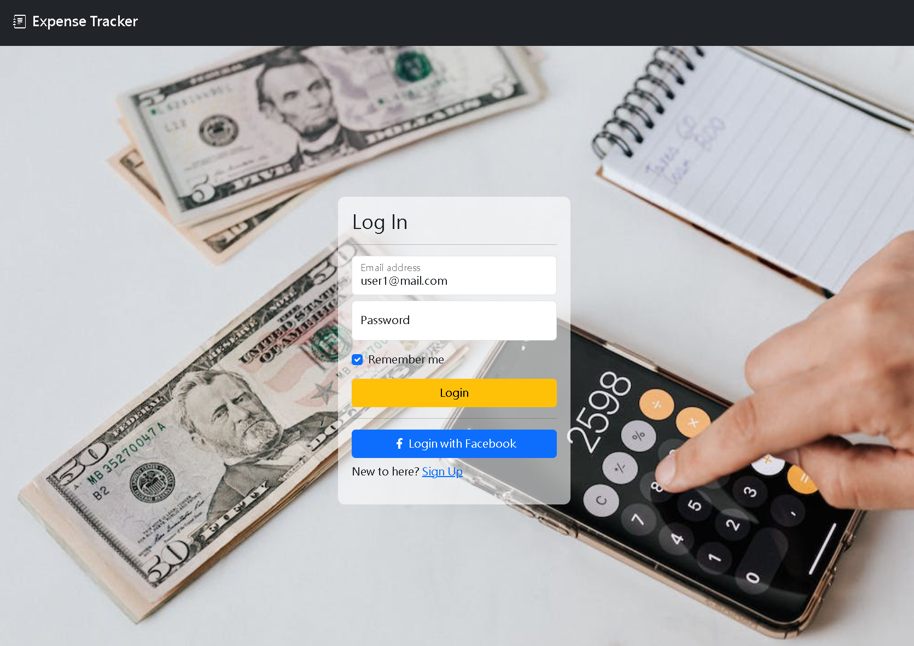

# Expense Tracker




## User Story

This web application allows you to:

1. Record your daily expense.
2. Add, update, and delete items what you cost.
3. Register an account using the default system or log in with your Facebook account to track your expenses.

## Getting Started

### Prerequisites

- Node.js ≥ v18.13.0
- MySql ≥ v8.0.26

### Installation

1. Clone the repo

   ```bash
   git clone https://github.com/Jerry-Chang975/AC-Expense-Tracker.git
   ```

2. Go to the project directory

   ```bash
   cd AC-Expense-Tracker
   ```

3. Install the required npm packages

   ```bash
   npm install
   ```

### Database Configuration

1. Create config.json in config folder, your can refer config.example.json

   ```
   ├──config
       ├──config.json
       └──config.example.json
   ```

   You have to set database connection parameters in config.json

   ```json
   {
     "development": {
       "username": "your username",
       "password": "your password",
       "database": "restaurant",
       "host": "your host",
       "dialect": "mysql"
     }
   }
   ```

2. Create new database in your MySQL server

   ```MySQL
   CREATE DATABASE `expense_tracker`
   ```

3. Run database migrations

   ```bash
   npm run migration
   ```

4. Add seed data

   ```bash
   npm run seed
   ```

### OAuth2 App Configuration

1.  Go to [Meta for Developers](https://developers.facebook.com/apps) to set up the OAuth2 configurations for your app.

2.  After creating the app, copy the App ID and App Key to your .env file (you need to create this file yourself by referring to .env.example).

    ```
    PORT = 3000
    NODE_ENV = development
    SESSION_SECRET = your_secret
    FACEBOOK_APP_ID = your_fb_app_id
    FACEBOOK_APP_SECRET = your_fb_app_secret
    FACEBOOK_CALLBACK_URL = http://localhost:3000/users/oauth2/redirect/facebook
    ```

### Start the Web App

```bash
$ npm run start
```
